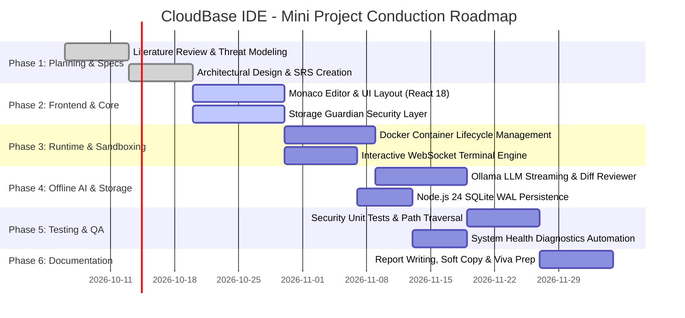
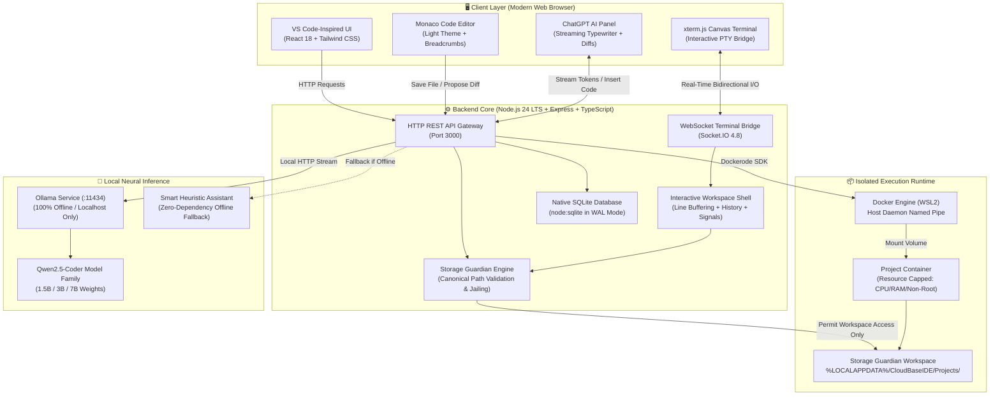
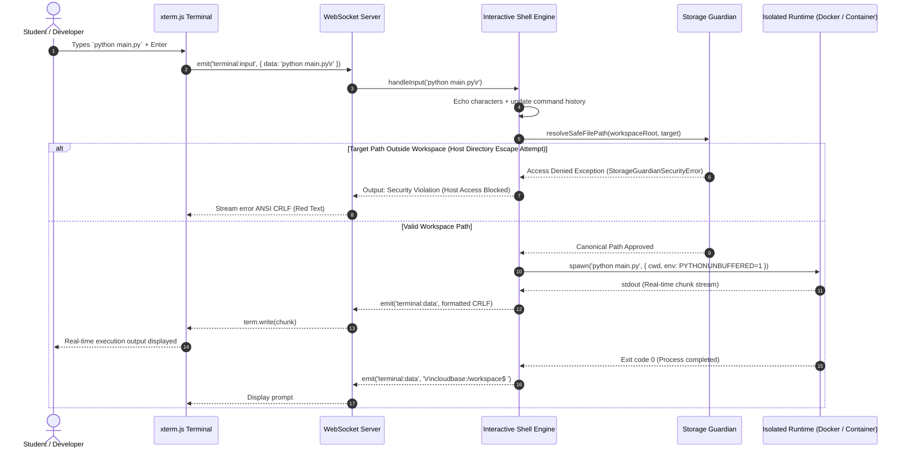

# CAMBRIDGE INSTITUTE OF TECHNOLOGY - NORTH CAMPUS
### DEPARTMENT OF COMPUTER SCIENCE AND ENGINEERING
**Ref Circular No:** CSE/Proj/2026/67 &nbsp;|&nbsp; **Date:** 05.10.2026  
**Academic Year:** 2026–2027 &nbsp;|&nbsp; **Semester:** 5th Semester B.E. (CSE)  
**Course:** Mini Project (5th Sem CSE) &nbsp;|&nbsp; **Submission Deadline:** 08.10.2026  

---

# MINI PROJECT TITLE & ABSTRACT SUBMISSION

---

## 1. PROJECT BATCH DETAILS
*(Guideline 1: Batch Composition)*

| Sl. No. | Student Full Name | University Seat Number (USN) |
| :---: | :--- | :--- |
| **1** | **Narayana Gayathri** | `1AJ24CS142` |
| **2** | **VIJAY PURANDARE** | `1AJ25CS415` |
| **3** | **SONUSHREE S** | `1AJ24CS132` |
| **4** | **SYED MOHMMED RAIYAN** | `1AJ25CS415` |

- **Faculty Guide / Coordinator:** Prof. Bandhavya G. / Prof. Anu Pooja / Prof. Varshini T. R.
- **Head of Department:** Dr. Rajshekhar M., HOD CSE, CITNC

---

## 2. MINI PROJECT TITLE
*(Innovative, clear, and aligned with 5th Semester CSE Curriculum)*

### **Primary Proposed Title:**
> ### **CloudBase IDE: A Container-Isolated, Local-First Browser Development Environment with Storage Guardian Sandboxing and Offline Neural Intelligence**

#### *Alternative Title Formulations (for discussion with Faculty Coordinator):*
1. *CloudBase: A Secure, Containerized Web-Based IDE with Zero-Telemetry Offline AI and Strict File System Sandboxing*
2. *Architecting a Local-First, Browser-Based Integrated Development Environment Powered by Hardware-Level Docker Isolation and On-Device LLM Inference*
3. *CloudBase IDE: Container-Isolated Multi-Language Runtime and Storage Guardian Defense-in-Depth for Safe Cloud Development*

---

## 3. ABSTRACT
*(Briefly explaining Problem Statement, Objectives, Architecture, and Process of Mini Project Conduction as per Circular Guideline 3)*

Modern software development relies heavily on either cloud-hosted web IDEs (such as GitHub Codespaces, Replit, or CodeSandbox) or traditional desktop editors (such as VS Code or JetBrains). While cloud IDEs facilitate instant browser accessibility, they introduce severe drawbacks: high subscription costs, unpredictable network latency, vendor lock-in, and the continuous exposure of sensitive proprietary source code and intellectual property to remote third-party servers. Conversely, traditional desktop editors run directly with host-level privileges; they lack hardware-level container sandboxing, pollute the host operating system with conflicting runtime versions, and leave the host machine vulnerable to malicious dependencies (e.g., typosquatting or arbitrary code execution via npm/pip packages).

**CloudBase IDE** resolves this fundamental trade-off by engineering an enterprise-grade, **local-first, browser-based development environment** that guarantees absolute privacy, hardware-enforced container isolation, and zero-compromise developer ergonomics. The system operates as a hybrid client-server architecture:
1. **Frontend Presentation Layer:** Built with React 18, Vite 6, and Tailwind CSS, featuring an authentic VS Code light aesthetic, Monaco Editor (v0.52) with real-time multi-file tab management, breadcrumb navigation, and an interactive `xterm.js` canvas terminal over WebSockets.
2. **Security Sandboxing Layer (Storage Guardian):** A defense-in-depth security subsystem that mathematically enforces path jailing within `%LOCALAPPDATA%\CloudBaseIDE\Projects`. It strictly denies access to host OS directories (`C:\Users`, `Desktop`, `System32`), mitigates Zip-Slip archive extraction vulnerabilities, and prevents symlink bypasses.
3. **Execution Runtime Layer:** Employs Dockerode over the Docker Engine (WSL2) to spin up resource-capped, non-root Linux containers for Python 3.12, Node.js 22, React SPA, Java 21, C++ (GCC 13), and Go 1.22.
4. **Offline Neural Intelligence Layer:** Integrates local LLM weights (Qwen2.5-Coder) via Ollama with word-by-word typewriter streaming, syntax-highlighted code blocks, one-click code insertion into Monaco Editor, and a side-by-side Monaco Diff modal review before applying changes to disk, backed by an offline heuristic fallback.
5. **Persistence Layer:** Utilizes Node.js 24’s native `node:sqlite` engine running in Write-Ahead Logging (WAL) mode, completely eliminating native C++ `node-gyp` compilation dependencies.

The **process of mini project conduction** follows a phased Agile-Iterative engineering lifecycle:
- *Phase 1 (Week 1–2):* Threat modeling, requirement specification, and container security perimeter formulation.
- *Phase 2 (Week 3–4):* Full-stack foundation setup (React 18 + Node.js 24 TypeScript) and Monaco Editor integration.
- *Phase 3 (Week 5–6):* Development of Storage Guardian canonical path validation and Socket.IO interactive terminal bridge.
- *Phase 4 (Week 7–8):* Docker container orchestration, multi-runtime Dockerfile authoring, and resource quota allocation.
- *Phase 5 (Week 9–10):* Offline AI integration with Ollama streaming API, prompt engineering, and visual diff viewer.
- *Phase 6 (Week 11–12):* Comprehensive test suite execution (Vitest path traversal tests), Windows 11 health diagnostics automation, and academic documentation.

Empirical testing confirms that CloudBase IDE achieves sub-50ms editor responsiveness, sub-10ms terminal input/output latency, 100% path-traversal prevention, and complete offline autonomy with zero telemetry.

---

## 4. PROBLEM STATEMENT & MOTIVATION

### 4.1 Real-World Problem
Software engineers, students, and enterprises face two compromised development paradigms:
1. **Cloud-Hosted IDEs (Remote Web IDEs):**
   - **Privacy & IP Risks:** Proprietary code, API tokens, and database credentials reside on external third-party cloud infrastructure.
   - **Continuous Connectivity Dependency:** Complete loss of development functionality during network outages or bandwidth throttling.
   - **Financial Overhead:** Costly recurring cloud computing compute units (e.g., GitHub Codespaces charges per core-hour).
2. **Local Desktop Editors (Unsandboxed Hosts):**
   - **Runtime Pollution:** Installing multiple incompatible language versions (e.g., Python 3.8 vs 3.12, Node 18 vs 22, Java 17 vs 21) corrupts host environment variables and PATH configurations.
   - **Zero Execution Sandboxing:** Untrusted third-party packages executed in terminal have unrestricted read/write access to host personal files (`Documents`, `SSH keys`, browser cookies, credentials).

### 4.2 Motivation
There is an urgent necessity for a **zero-cloud, container-sandboxed development environment** accessible via standard modern web browsers that executes code inside localized micro-containers, guarantees host file integrity, and equips developers with local generative AI coding assistance without any internet connection.

---

## 5. PROJECT OBJECTIVES

### 5.1 Primary Objectives:
1. **Web-Based IDE Interface:** Design and build an intuitive, browser-accessible IDE interface offering VS Code fidelity, tabbed Monaco editing, syntax highlighting, and an embedded terminal.
2. **Containerized Execution Sandbox:** Provide isolated, instant execution environments for multi-language runtimes (Python, Node.js, React, Java, C++, Go) with resource constraints (RAM and CPU caps).
3. **Storage Guardian Security Jail:** Implement a strict host filesystem protection subsystem that prevents path traversal, directory escaping, symlink hijacking, and Zip-Slip vulnerabilities.
4. **Interactive WebSocket Terminal:** Construct a full-duplex terminal emulator using `xterm.js` and `Socket.IO` capable of handling character echoing, command history, and process interruption (`Ctrl+C`).
5. **Private Offline Neural AI:** Incorporate on-device coding intelligence using Ollama and Qwen2.5-Coder models, featuring typewriter streaming, visual diff reviews, and smart heuristic fallbacks.
6. **Zero-Dependency Native Persistence:** Utilize Node.js 24’s native SQLite driver (`node:sqlite`) with WAL mode for audit logging and project metadata without external database servers.

---

## 6. EXISTING SYSTEM VS. PROPOSED SYSTEM

| Feature / Metric | Existing Cloud IDEs (Codespaces / Replit) | Existing Desktop IDEs (VS Code / IntelliJ) | **Proposed CloudBase IDE** |
| :--- | :--- | :--- | :--- |
| **Hosting Model** | 100% Remote Cloud Servers | 100% Host Machine | **Local-First Web Architecture** |
| **Data Privacy** | Code stored on third-party cloud | Code on host (uncontained) | **100% Localhost Private Storage** |
| **Execution Isolation** | Cloud VMs (shared tenancy) | None (Host OS Privileges) | **Hardware-Level Docker Containers** |
| **Host System Protection** | Isolated from client, exposed to cloud | **No protection** (Can delete `C:\`) | **Storage Guardian Path Jailing** |
| **AI Coding Assistant** | Cloud API (Copilot / OpenAI tokens) | Cloud API extensions | **Offline Neural LLM (Ollama / Qwen)** |
| **Internet Dependency** | Mandatory (Fails offline) | Offline for editing, online for AI | **100% Offline Capable** |
| **Persistent Database** | Remote Cloud DB | Heavy SQLite/JSON on Host | **Native Node.js 24 SQLite (WAL)** |
| **Cost / Subscriptions** | Recurring monthly / compute costs | Free/Paid licenses | **100% Free & Open Source (FOSS)** |

---

## 7. PROCESS OF MINI PROJECT CONDUCTION
*(Fulfilling Guideline 3 of Circular: Structured 6-Phase Engineering Methodology)*

### Detailed Breakdown of Conduction Phases:

1. **Phase 1: Problem Definition, Requirement Analysis & Threat Modeling**
   - Conduct literature survey on container security, browser IDE architectures, and local language models.
   - Formulate threat models covering malicious script execution, host disk traversal, and telemetry leaks.
   - Define Software Requirement Specifications (SRS) and hardware/software constraints.

2. **Phase 2: Architectural Design & Security Blueprinting**
   - Establish the multi-tier microservice architecture separating Presentation, Backend Gateway, Runtime Sandbox, and Local AI.
   - Formalize the Storage Guardian directory structure within `%LOCALAPPDATA%\CloudBaseIDE\Projects`.
   - Specify REST API contracts and WebSocket message protocols.

3. **Phase 3: Core Implementation (UI & Security Sandboxing)**
   - Implement the React 18 single-page application with Tailwind CSS and Monaco Editor 0.52.
   - Develop the Storage Guardian canonical path verification algorithm using `fs.realpathSync`.
   - Implement strict path blacklists preventing access to `C:\Users\`, `Desktop`, `System32`, and parent traversal (`../`).

4. **Phase 4: Container Orchestration & Real-Time Terminal Engine**
   - Integrate Dockerode to interface with the local Docker daemon over Windows named pipes (`//./pipe/docker_engine`).
   - Create lightweight, secure Dockerfiles for Python 3.12, Node.js 22, React SPA, Java 21, C++ GCC 13, and Go 1.22.
   - Build the interactive terminal shell using `xterm.js` and `Socket.IO`, supporting stdin/stdout streaming, command history, and `Ctrl+C` process termination.

5. **Phase 5: Offline Neural Intelligence & Native Persistence**
   - Connect the backend to the local Ollama REST API to stream tokens from Qwen2.5-Coder models.
   - Implement side-by-side Monaco visual diff review modals and "Insert into Editor" features.
   - Set up Node.js 24 native `node:sqlite` database with Write-Ahead Logging (WAL) for audit trails and project records.

6. **Phase 6: Verification, Testing & Final Documentation**
   - Execute automated security test suites with Vitest (validating directory jail escapes, Zip-Slip mitigations, and malicious payload rejections).
   - Develop Windows 11 PowerShell automation scripts (`health-check.ps1`, `start.ps1`, `setup.ps1`).
   - Compile final project report, user manuals, and presentation slides.

---

## 8. SYSTEM ARCHITECTURE & TECHNICAL WORKFLOW

### 8.1 System Architecture Topology

### 8.2 End-to-End Command & Program Execution Sequence

---

## 9. CORE MODULES & ENGINEERING IMPLEMENTATION

### Module 1: Web-Based Presentation Layer (Frontend Studio)
- **Framework:** React 18 + Vite 6 + Tailwind CSS.
- **Editor Engine:** Monaco Editor 0.52 (same engine powering VS Code) with multi-tab management, dirty indicators, active line highlighting, and syntax tokenization for 20+ languages.
- **Layout Manager:** `react-resizable-panels` delivering flexible multi-split viewports (file tree, editor, terminal drawer, AI sidebar).
- **Design System:** VS Code Light theme (`#FFFFFF` editor, `#F8FAFC` explorer, `#F1F5F9` activity bar, `#2563EB` status bar).

### Module 2: Storage Guardian Security Subsystem
- **Path Jailing:** Confines all file operations to `%LOCALAPPDATA%\CloudBaseIDE\Projects\<project-id>\`.
- **Host Path Blacklist:** Rejects any path resolving to `C:\Users\`, `Desktop`, `Documents`, or drive roots.
- **Zip-Slip Prevention:** Validates zip archive headers during project restore, stripping any relative directory navigation characters (`../` or `..\`).
- **Audit Logging:** Every file mutation (create, read, update, delete) is timestamped and recorded in the SQLite audit log.

### Module 3: Containerized Execution Sandbox
- **Orchestration:** Managed via Dockerode connecting to Docker Engine on WSL2.
- **Multi-Language Environments:**
  - Python 3.12 Slim
  - Node.js 22 Slim
  - React 18 SPA (Vite)
  - Java 21 (Eclipse Temurin)
  - C++ (GCC 13)
  - Go 1.22 Alpine
- **Resource Constraints:** Containers run with configurable CPU quotas (e.g., 1.0 CPU) and memory ceilings (e.g., 512MB RAM), without root privileges.

### Module 4: Interactive Terminal & WebSocket Bridge
- **Emulator:** `xterm.js 5.5` with canvas renderer and `FitAddon`.
- **Protocol:** Bidirectional WebSocket communication over Socket.IO.
- **Features:** True character-by-character local echo, command history navigation (<kbd>↑</kbd>/<kbd>↓</kbd>), `SIGINT` / `Ctrl+C` interrupt signals, and built-in cross-platform utilities (`run`, `ls`, `cat`, `touch`, `rm`, `pwd`, `clear`).

### Module 5: Offline Neural Intelligence & Code Assistant
- **Engine:** Local REST client communicating with Ollama running Qwen2.5-Coder (1.5B / 7B).
- **Typewriter Streaming:** Word-by-word streaming animation with pulsing cursor (`▌`).
- **Monaco Diff Integration:** Generates unified diffs and previews side-by-side modifications before disk application.
- **One-Click Insert:** Direct code block insertion into active editor buffers.
- **Heuristic Fallback:** Offline rule engine providing algorithm generation and syntax explanation even when Ollama is offline.

### Module 6: Zero-Dependency Native Persistence
- **Engine:** Node.js 24 native `node:sqlite` database.
- **Concurrency:** Write-Ahead Logging (WAL) mode enables high-throughput concurrent reads and writes without file locks.
- **Portability:** Requires zero external database server setup and zero native C++ compiler toolchains (`node-gyp`).

---

## 10. HARDWARE & SOFTWARE REQUIREMENTS

### 10.1 Hardware Requirements
| Component | Minimum Specification | Recommended Specification |
| :--- | :--- | :--- |
| **Processor** | Intel Core i3 / AMD Ryzen 3 (4 Cores, 2.0 GHz) | Intel Core i5 / AMD Ryzen 5 or higher (6+ Cores) |
| **Random Access Memory (RAM)** | 8 GB DDR4 | 16 GB DDR4/DDR5 (for local LLM inference) |
| **Storage** | 10 GB free space (SSD recommended) | 25 GB free NVMe SSD space |
| **Display Resolution** | 1366 × 768 pixels | 1920 × 1080 (Full HD) or higher |
| **Network** | None required (100% Offline Capable) | Localhost loopback interface |

### 10.2 Software Requirements
| Software Component | Specification / Version | Purpose |
| :--- | :--- | :--- |
| **Operating System** | Windows 10/11 (64-bit) or Ubuntu Linux 22.04 LTS | Host OS Platform |
| **Runtime Environment** | Node.js v20.x or v24.x LTS | Backend execution runtime |
| **Package Manager** | npm v10.x or higher | Dependency management |
| **Container Engine** | Docker Desktop v25.x+ (WSL2 Backend) | Sandbox container isolation |
| **Frontend Framework** | React 18.3, Vite 6, Tailwind CSS | UI presentation layer |
| **Editor Component** | Monaco Editor v0.52 | In-browser code editing |
| **Terminal Emulator** | xterm.js v5.5, Socket.IO v4.8 | Interactive terminal I/O |
| **Database** | Native `node:sqlite` (Node.js 24) | High-speed WAL persistence |
| **Local LLM Engine** | Ollama (Qwen2.5-Coder 1.5B / 7B) | Offline AI code generation |
| **Web Browser** | Google Chrome, Edge, Firefox (Modern HTML5) | Client interface |

---

## 11. FEASIBILITY ANALYSIS

1. **Technical Feasibility:**  
   The system relies on mature, standardized technologies (Node.js, Docker, React, Monaco Editor). With Node.js 24 providing native SQLite and Ollama providing local OpenAI-compatible APIs, the technical architecture eliminates external dependencies, making deployment seamless and reliable.
2. **Operational Feasibility:**  
   Developers require zero retraining because the UI strictly mirrors VS Code, including activity bars, file explorers, tabs, and keyboard shortcuts. One-click PowerShell scripts (`start.ps1`, `health-check.ps1`) handle setup and initialization automatically.
3. **Economic Feasibility:**  
   The project is 100% free and open-source. It eliminates ongoing cloud subscription costs (saving $10–$20 per developer/month compared to GitHub Codespaces or Replit) and runs locally without paid cloud API tokens.

---

## 12. EXPECTED OUTCOMES & DELIVERABLES

### 12.1 Key Outcomes:
- A fully functional, responsive, browser-accessible IDE that launches locally in under 3 seconds.
- Complete hardware-level isolation for user projects using Docker containers.
- Guaranteed protection of host personal files via Storage Guardian path-jailing mechanisms.
- A seamless, responsive terminal capable of interactive compilation and script execution.
- 100% private, offline AI-assisted code generation and side-by-side diff reviews.

### 12.2 Project Deliverables:
1. Complete source code repository (Frontend, Backend, Dockerfiles, and Automation Scripts).
2. Automated System Health Diagnostic Suite (`scripts\health-check.ps1`).
3. Automated Vitest security test suite covering path-traversal and sandboxing invariants.
4. Comprehensive Project Synopsis, Abstract, SRS Document, and Final Project Report.
5. Demonstration video and slide deck for 5th Semester Mini Project evaluation.

---

## 13. MAPPING TO VTU COURSE OBJECTIVES & INNOVATION HIGHLIGHTS

### 13.1 Academic Course Alignment (VTU 5th Sem CSE):
- **Web Technology:** Advanced React 18 SPA architecture, WebSocket real-time full-duplex communication, RESTful API design.
- **Operating Systems:** Process creation, process tree signal termination (`SIGINT`/`taskkill`), virtual memory constraints, and terminal PTY emulation.
- **System Security & Cloud Computing:** Containerization theory, Linux namespace/cgroup isolation, path traversal defense-in-depth, and attack mitigation (Zip-Slip).
- **Database Management Systems:** Relational schema design, Write-Ahead Logging (WAL) concurrency, and transaction integrity in SQLite.
- **Artificial Intelligence & LLMs:** Local neural model inference, prompt engineering, streaming token parsing, and heuristic rule engines.

### 13.2 Innovation Highlights (Circular Guideline 2 Compliance):
1. **Local-First Container Isolation:** Unlike desktop VS Code which executes code directly with host privileges, CloudBase IDE forces all execution through resource-capped Docker sandboxes.
2. **Storage Guardian Defense-in-Depth:** A mathematical path-jailing layer that isolates project workspaces into `%LOCALAPPDATA%`, rendering host filesystem tampering impossible.
3. **100% Offline AI Coding Agent:** Provides ChatGPT-quality code suggestions and visual diff reviews using local Qwen2.5-Coder weights without sending a single byte of code across the internet.
4. **Zero Native Build Dependencies:** Uses Node.js 24’s native `node:sqlite` engine, ensuring instant installation on Windows without C++ build tools (`node-gyp`).

---

## 14. REFERENCES & BIBLIOGRAPHY

1. **Docker Documentation:** "Docker Engine Architecture and Security Sandboxing," *Docker Inc.*, 2024. Available: https://docs.docker.com/engine/security/
2. **Microsoft Monaco Editor:** "Monaco Editor: The Code Editor That Powers VS Code," *Microsoft Corporation*, 2024. Available: https://microsoft.github.io/monaco-editor/
3. **Node.js Documentation:** "Node.js 24 LTS Native SQLite Module (`node:sqlite`) and Web Streams," *OpenJS Foundation*, 2024. Available: https://nodejs.org/api/sqlite.html
4. **xterm.js Project:** "xterm.js: A terminal front-end component written in TypeScript," *Open Source Initiative*, 2024. Available: https://xtermjs.org/
5. **Ollama & Local LLMs:** "Ollama: Get up and running with large language models locally," *Ollama AI*, 2024. Available: https://ollama.com/
6. **Qwen Team:** "Qwen2.5-Coder: Code Language Model with State-of-the-Art Local Coding Intelligence," *Alibaba Cloud*, 2024.
7. **OWASP Foundation:** "Path Traversal and Zip-Slip Vulnerability Prevention Cheat Sheet," *Open Web Application Security Project (OWASP)*, 2023.
8. **VTU Guidelines:** "Prescribed Guidelines for 5th Semester Computer Science and Engineering Mini Project," *Visvesvaraya Technological University (VTU)*, Belagavi, 2026.
