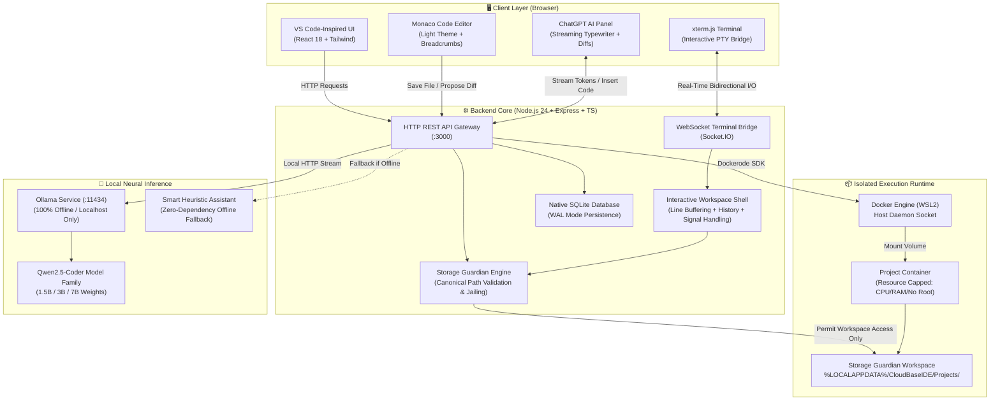
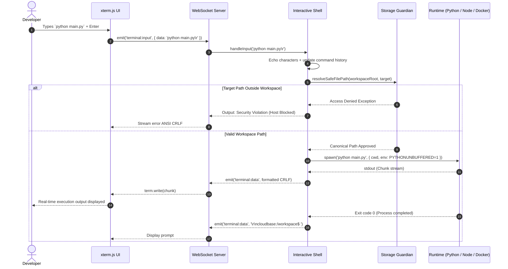

# ⚡ CloudBase IDE

<div align="center">


### **Your Code. Your Environment. Your AI. All in One Place.**

*A local-first, container-isolated, browser-based integrated development environment engineered for absolute privacy, native Docker execution, offline neural intelligence, and zero-compromise developer ergonomics.*

[](LICENSE)
[](https://www.typescriptlang.org/)
[](https://nodejs.org/)
[](https://react.dev/)
[](https://microsoft.github.io/monaco-editor/)
[](https://www.docker.com/)
[](https://sqlite.org/)
[](https://vitejs.dev/)
[](https://microsoft.com)
[](https://github.com/vijju9019/CloudBase-IDE)

---

[Key Capabilities](#-key-capabilities) •
[Architecture](#-system-architecture) •
[Tech Stack & Rationales](#-technology-stack--architectural-rationales) •
[Storage Guardian](#-storage-guardian-defense-in-depth) •
[Terminal Engine](#-interactive-terminal-execution-engine) •
[AI Coding Agent](#-chatgpt-grade-offline-ai-assistant) •
[Getting Started](#-getting-started) •
[API Reference](#-rest--websocket-api-reference)

</div>

---

## 💡 Executive Summary & Philosophy

In modern software development, developers are forced to choose between two compromised paradigms:
1. **Cloud-Hosted Web IDEs** that expose sensitive source code, inject unpredictable network latency, demand perpetual monthly subscriptions, and risk data exfiltration.
2. **Traditional Desktop Editors** that clutter the host operating system with conflicting runtime versions, lack hardware-level container sandboxing, and provide zero containment against untrusted scripts or malicious packages.

**CloudBase IDE** resolves this dilemma. It delivers a **local-first, desktop-grade development environment** accessed through any modern browser. Every project is executed inside a dedicated, resource-capped container sandbox backed by **Storage Guardian**—a security subsystem that mathematically prevents code from touching host directories (`C:\Users`, `Documents`, `Desktop`). Powered by local neural models via **Ollama** and a VS Code-inspired light interface, CloudBase IDE is completely private, blazing fast, and 100% offline-capable.

---

## 🌟 Key Capabilities

- **VS Code-Inspired Ergonomics**: 48px Activity Bar, collapsible File Explorer with extension-colored file icons, editor tabs with dirty indicators, breadcrumb navigation, and an authentic status bar (`#2563EB`).
- **Hardware-Isolated Execution**: Instant provisioning of isolated environments for Python 3.12, Node.js 22, React SPA, Java 21 Temurin, C++ (GCC 13), and Go 1.22.
- **Storage Guardian Defense-in-Depth**: Strict directory jailing (`%LOCALAPPDATA%\CloudBaseIDE\Projects`). Hard rejection of host directory traversal (`../`), symlink escapes, and Zip-Slip archive extractions.
- **Interactive Terminal**: Full-duplex `xterm.js` terminal over WebSockets with real-time character echo, command history buffer (<kbd>↑</kbd>/<kbd>↓</kbd>), <kbd>Ctrl+C</kbd> process termination, and built-in cross-platform utilities (`run`, `ls`, `cat`, `touch`, `rm`, `pwd`, `clear`).
- **ChatGPT-Grade Offline AI**: Powered by local Qwen2.5-Coder weights via Ollama with word-by-word typewriter streaming, syntax-highlighted code blocks, one-click **Copy**, direct **"Insert into File"** integration, and contextual follow-up chips.
- **Interactive Monaco Diff Review**: Side-by-side visual diff inspection for AI-generated code proposals before writing a single byte to disk.
- **Zero-Dependency Native SQLite**: Built on Node.js 24's native `node:sqlite` engine running in Write-Ahead Logging (WAL) mode for high-concurrency, zero-node-gyp persistence.
- **Live Sandbox Previews**: Embedded iframe preview engine for web applications with automated port forwarding and external browser tab support.
- **Automated Windows 11 Diagnostics**: Enterprise-grade PowerShell automation for environment health checks, port probes, container lifecycle management, and disaster recovery.

---

## 🏛 System Architecture

The following flowcharts demonstrate how CloudBase IDE components communicate across presentation, runtime execution, security containment, and offline neural inference layers.

### High-Level Topology



### End-to-End Command & Program Execution Sequence



---

## 🛠 Technology Stack & Architectural Rationales

Every dependency in CloudBase IDE was chosen after evaluating security footprint, compilation requirements on Windows, memory efficiency, and developer productivity.

| Layer | Technology | Architectural Rationale ("Why This Choice?") |
|---|---|---|
| **Frontend Framework** | **React 18 + Vite 6** | Instantaneous hot module replacement (HMR), sub-50ms build times, concurrent rendering for smooth terminal and editor updates, zero runtime overhead. |
| **Code Editor** | **Monaco Editor (0.52)** | The battle-tested editing engine behind VS Code. Provides native syntax tokenization, language services, multi-cursor editing, bracket pair colorization, and visual side-by-side diff viewers. |
| **Terminal Emulator** | **xterm.js (5.5)** | The industry-standard canvas/DOM terminal emulator. Full ANSI escape sequence support, high-performance character grid rendering, WebLinks, and auto-resizing via FitAddon. |
| **UI Styling** | **Tailwind CSS + Lucide Icons** | Strict tokenized design system enforcing the VS Code light aesthetic (`#FFFFFF` editor, `#F8FAFC` explorer, `#F1F5F9` activity bar, `#2563EB` status bar) without CSS bloat. |
| **State Management** | **Zustand (5.0)** | Minimalist, unopinionated micro-store avoiding React context re-render thrashing during high-frequency terminal keystrokes and streaming token updates. |
| **Layout Engine** | **react-resizable-panels** | Fluid, non-blocking multi-split layout management across file explorer, editor workspace, integrated bottom drawer, and AI panel. |
| **Backend Runtime** | **Node.js 24 LTS + TypeScript** | First-class native ES module support, built-in security permissions, high I/O throughput, and native runtime SQLite integration. |
| **Database Engine** | **Native `node:sqlite`** | Utilizes Node 24's native SQLite bindings in Write-Ahead Logging (WAL) mode. Eliminates native C++ compilation errors, `node-gyp` hurdles, and external database servers. |
| **Real-time Bridge** | **Socket.IO (4.8)** | Auto-reconnecting, low-latency WebSocket connection with binary chunk support for interactive terminal input/output multiplexing. |
| **Container Engine** | **Docker Engine (Dockerode)** | Linux container isolation on Windows using the WSL2 backend. Strict resource constraints (CPU quotas, memory limits, read-only root options). |
| **Local AI Inference** | **Ollama REST API** | 100% private, on-device inference using the Qwen2.5-Coder model family. Code never leaves local memory; zero external API tokens required. |
| **Security Shield** | **Storage Guardian** | Custom defense-in-depth barrier enforcing path jailing, symlink verification, Zip-Slip attack mitigation, and immutable disk mutation audit logs. |

---

## 🛡 Storage Guardian: Defense-in-Depth

Storage Guardian acts as an immutable sandbox perimeter between untrusted project code and your physical Windows workstation.

```
%LOCALAPPDATA%\CloudBaseIDE\
  ├── Projects/                  <-- Project workspaces (ONLY these folders mount to Docker)
  │   ├── demo-python-app/
  │   │   ├── main.py
  │   │   └── requirements.txt
  │   └── microservice-node/
  ├── Database/
  │   └── cloudbase.sqlite       <-- SQLite database with WAL journals
  ├── Backups/                   <-- Sanitized project zip backups
  ├── Logs/                      <-- Immutable operation audit trail
  └── Models/                    <-- Offline LLM weights repository
```

### Security Invariants Guaranteed by Storage Guardian:
1. **Host Path Blacklist**: Under no circumstance will the backend, file APIs, or Docker mounts bind to:
   - `C:\Users\<Username>\` (User profile directory)
   - `Desktop`, `Documents`, `Downloads`, `Pictures`, `Videos`
   - Windows Root Drives (`C:\`, `D:\`)
2. **Canonical Jail Verification**: Every file read, write, rename, or deletion resolves the real filesystem path using `fs.realpathSync` to ensure it resides strictly within the assigned project directory.
3. **Zip-Slip Prevention**: Archive extraction routines inspect every zip header, rejecting any entry containing relative path sequences (`../` or `..\`) or absolute drive roots.
4. **Immutable Audit Trail**: Every file operation and container lifecycle event is logged with timestamps, source IP, operation type, and outcome to `cloudbase.sqlite`.

---

## ⚡ Interactive Terminal Execution Engine

The terminal system is not a static display—it is an **Interactive Workspace Shell** running directly inside the project container or workspace jail.

```bash
cloudbase:/workspace$ ls
main.py (441 B)  README.md (94 B)  requirements.txt (50 B)

cloudbase:/workspace$ python main.py
=============================================
CloudBase IDE Python Runtime - Python 3.14.6
=============================================
Hello, Demo Python App! Welcome to CloudBase IDE.
Environment: Isolated Container
AI Agent: Ready
---------------------------------------------
cloudbase:/workspace$ 
```

### Terminal Features:
- **Interactive Stdin/Stdout**: Character-by-character local echo with support for interactive CLI prompts.
- **Command History**: Navigate previous commands effortlessly using the <kbd>↑</kbd> and <kbd>↓</kbd> arrow keys.
- **Ctrl+C Interrupt**: Send `SIGINT` signals (or native Windows `taskkill` process tree termination) to kill long-running loops or hung scripts immediately.
- **Cross-Platform Utilities**:
  - `run`: Auto-detects entry points (`main.py`, `index.js`, `package.json`) and launches them.
  - `ls`: Color-coded file and folder listing with human-readable byte sizes.
  - `cat <file>`: Inspect file content directly in the terminal without opening an editor tab.
  - `touch <file>`: Create new files instantly within the workspace jail.
  - `rm <file>`: Safely delete files within the project boundary.
  - `cd <folder>` & `pwd`: Directory navigation confined to the workspace.
  - `clear` / `cls`: Instant screen buffer wipe.

---

## 🤖 ChatGPT-Grade Offline AI Assistant

CloudBase IDE features a localized AI coding assistant modeled after ChatGPT and GitHub Copilot Chat, designed to run 100% offline.

```
┌────────────────────────────────────────────────────────┐
│  CloudBase AI                   ● ChatGPT Mode • Active│
├────────────────────────────────────────────────────────┤
│                                                        │
│  You                                                   │
│  Explain main.py and give me a factorial function      │
│                                                        │
│  CloudBase AI                                          │
│  ✨ Here is an analysis of main.py along with a clean   │
│  recursive factorial function:                         │
│                                                        │
│  ┌─ PYTHON ────────────────────────── [Copy] [Insert] ─┐
│  │ def factorial(n: int) -> int:                       │
│  │     if n <= 1:                                      │
│  │         return 1                                    │
│  │     return n * factorial(n - 1)                     │
│  └─────────────────────────────────────────────────────┘
│                                                        │
│  [💡 Explain step-by-step] [🧪 Write tests] [⚡ Optimize]│
├────────────────────────────────────────────────────────┤
│ [ Ask CloudBase AI (ChatGPT Mode)...          ] [Send] │
└────────────────────────────────────────────────────────┘
```

### Assistant Capabilities:
- **Real-Time Token Streaming**: Word-by-word typewriter animation with a pulsing cursor (`▌`) mimicking conversational AI models.
- **Syntax-Highlighted Code Blocks**:
  - Header displays language indicator.
  - **Copy Button**: One-click copy with visual confirmation.
  - **Insert into File Button**: Instantly injects the generated code snippet directly into your active tab in Monaco Editor!
- **Context Injection**: Automatically grabs the active file name, language, and selected code buffer into each prompt.
- **Side-by-Side Diff Review**: When the AI proposes changes, inspect the unified diff in a modal Diff Editor and approve or reject before anything is saved.
- **Interactive Suggestion Chips**: Dynamic follow-up chips appear after every answer (`💡 Explain step-by-step`, `🧪 Write unit tests`, `⚡ Optimize performance`, `🚀 How do I run this?`).
- **Offline Heuristic Fallback**: If Ollama is not running, CloudBase IDE's built-in rule engine handles coding queries, algorithms, file explanations, and test scaffolding.

---

## 📁 Project Structure

```
CloudBaseIDE/
├── backend/                        # Express + TypeScript Backend
│   ├── src/
│   │   ├── ai/                     # Ollama service & heuristic AI agent
│   │   ├── database/               # Native node:sqlite schema & migrations
│   │   ├── docker/                 # Container lifecycle & Dockerode wrapper
│   │   ├── routes/                 # REST API controllers
│   │   ├── services/               # Execution & project scaffolding
│   │   ├── storage/                # Storage Guardian security jail
│   │   ├── tests/                  # Security & guardian unit tests
│   │   ├── websocket/              # Interactive terminal socket handler
│   │   └── index.ts                # Backend server bootstrap
│   ├── package.json
│   └── tsconfig.json
├── frontend/                       # React 18 + Vite Frontend
│   ├── src/
│   │   ├── components/
│   │   │   ├── ai/                 # ChatGPT panel & message views
│   │   │   ├── common/             # Header, badges, and status pills
│   │   │   ├── dashboard/          # Project cards & system metrics
│   │   │   ├── editor/             # Monaco editor, tabs, and diff modal
│   │   │   ├── explorer/           # VS Code-style file tree
│   │   │   └── terminal/           # xterm.js terminal integration
│   │   ├── pages/                  # Dashboard, IDE, Wizard, Guardian, Settings
│   │   ├── services/               # Axios/Fetch API client
│   │   ├── store/                  # Zustand application & project stores
│   │   └── index.css               # VS Code light design system
│   ├── package.json
│   └── vite.config.ts
├── environments/                   # Isolated Docker environment definitions
│   ├── cpp/Dockerfile              # GCC 13 Runtime
│   ├── go/Dockerfile               # Go 1.22 Alpine
│   ├── java/Dockerfile             # Eclipse Temurin OpenJDK 21
│   ├── node/Dockerfile             # Node.js 22 Slim
│   ├── python/Dockerfile           # Python 3.12 Slim
│   └── react/Dockerfile            # Vite + React 18 Sandbox
├── docker/                         # Docker Compose orchestration
│   └── docker-compose.yml
├── scripts/                        # PowerShell management automation
│   ├── health-check.ps1            # 5-step diagnostic health scanner
│   ├── setup.ps1                   # Environment setup script
│   ├── start.ps1                   # Service launcher
│   └── stop.ps1                    # Clean shutdown script
├── .gitignore
├── package.json                    # Workspace orchestration package
└── README.md
```

---

## 🚀 Getting Started

### Prerequisites

| Tool | Recommended Version | Purpose |
|---|---|---|
| **Node.js** | `v20.x` or `v24.x LTS` | Host runtime with native `node:sqlite` support |
| **npm** | `v10.x` or higher | Package management |
| **Docker Desktop** | `v25.x+` (WSL2 Backend) | Containerized project isolation *(Optional for local sandbox)* |
| **Ollama** | Latest | Local neural inference for offline AI *(Optional)* |
| **Windows OS** | Windows 10/11 (64-bit) | Validated host environment |

---

### Step 1: Clone the Repository

```bash
git clone https://github.com/vijju9019/CloudBase-IDE.git
cd CloudBase-IDE
```

---

### Step 2: Automated One-Click Setup (Windows 11)

Run the included PowerShell setup script to configure dependencies:

```powershell
powershell -ExecutionPolicy Bypass -File .\scripts\setup.ps1
```

Or install dependencies manually:

```bash
npm install
npm --prefix backend install
npm --prefix frontend install
```

---

### Step 3: Run System Health Diagnostics

Verify that Node, Docker, and Storage Guardian are properly configured:

```powershell
powershell -ExecutionPolicy Bypass -File .\scripts\health-check.ps1
```

```text
======================================================
  CLOUDBASE IDE - SYSTEM DIAGNOSTICS & HEALTH CHECK
======================================================

[1/5] Host OS Environment:       [PASS] Windows 11 64-bit
[2/5] Runtime & Package Manager: [PASS] Node.js v24.19.0 / npm 11.17.0
[3/5] Docker Engine:             [PASS] Docker Desktop 29.x
[4/5] Ollama Offline AI:         [INFO] Ollama standing by / Heuristics active
[5/5] Storage Guardian:          [PASS] %LOCALAPPDATA%\CloudBaseIDE verified

Diagnostics complete. All systems nominal.
```

---

### Step 4: Launch the IDE

Start both backend and frontend servers with a single command:

```powershell
powershell -ExecutionPolicy Bypass -File .\scripts\start.ps1
```

Or run via npm:

```bash
npm run dev
```

Open your browser:
- **Frontend IDE UI**: [http://localhost:5173](http://localhost:5173)
- **Backend API Server**: [http://127.0.0.1:3000](http://127.0.0.1:3000)

---

### Step 5: (Optional) Enable Local AI Models via Ollama

1. Download Ollama from [ollama.com/download](https://ollama.com/download).
2. Pull the recommended coding model:
   ```bash
   ollama pull qwen2.5-coder:1.5b
   ```
   *(For systems with 16GB+ RAM or dedicated GPUs: `ollama pull qwen2.5-coder:7b`)*
3. Start the service:
   ```bash
   ollama serve
   ```
4. CloudBase IDE will automatically detect the model and display `● ChatGPT Mode • Active` in the AI panel!

---

## 📡 REST & WebSocket API Reference

### Project & Environment APIs

| Method | Endpoint | Description |
|---|---|---|
| `GET` | `/api/health` | Basic service heartbeat and uptime |
| `GET` | `/api/status` | Comprehensive status of Backend, Docker, Ollama, and Storage |
| `GET` | `/api/projects` | List all existing workspace projects |
| `POST` | `/api/projects` | Scaffold a new project with container limits |
| `GET` | `/api/projects/:id` | Retrieve project metadata and container state |
| `DELETE` | `/api/projects/:id` | Safely remove project workspace and associated container |
| `POST` | `/api/projects/:id/start` | Start isolated Docker container |
| `POST` | `/api/projects/:id/stop` | Stop running Docker container |
| `POST` | `/api/projects/:id/run` | Execute primary project entry file |
| `POST` | `/api/projects/:id/stop-execution` | Terminate running execution process |

### File & Storage Guardian APIs

| Method | Endpoint | Description |
|---|---|---|
| `GET` | `/api/projects/:id/files` | Get project file tree within workspace jail |
| `POST` | `/api/projects/:id/files` | Create new file or folder |
| `DELETE` | `/api/projects/:id/files` | Delete file or folder within workspace |
| `GET` | `/api/projects/:id/files/content` | Read file buffer |
| `PUT` | `/api/projects/:id/files/content` | Save file modifications |
| `GET` | `/api/storage/usage` | Storage breakdown (Projects, Models, Database, Backups) |
| `POST` | `/api/storage/backup` | Create verified zip archive of project |
| `POST` | `/api/storage/restore` | Restore backup with Zip-Slip attack sanitization |
| `GET` | `/api/preview/:id/*` | Sandbox HTTP preview for web applications |

### AI Coding Agent APIs

| Method | Endpoint | Description |
|---|---|---|
| `GET` | `/api/ai/status` | Probe Ollama connectivity and loaded models |
| `POST` | `/api/ai/chat` | Streaming ChatGPT-style conversational assistant |
| `POST` | `/api/ai/explain` | Code explanation with inline markdown analysis |
| `POST` | `/api/ai/debug` | Analyze execution errors and propose fixes |
| `POST` | `/api/ai/propose-change` | Generate structured multi-file diff proposals |
| `POST` | `/api/ai/apply-change` | Apply approved diff proposal directly to disk |

### WebSocket Events (`/socket.io`)

| Direction | Event Name | Payload | Description |
|---|---|---|---|
| `Client -> Server` | `terminal:init` | `{ projectId, cols, rows }` | Initialize terminal session for workspace |
| `Client -> Server` | `terminal:input` | `{ data: string }` | Send keystrokes / commands to shell |
| `Server -> Client` | `terminal:data` | `string` | Streamed ANSI terminal output with CRLF |

---

## 🧪 Automated Testing & Verification

The test suite validates security constraints, path traversal protection, Zip-Slip mitigations, and database transactions:

```bash
# Run backend security & unit tests
npm --prefix backend run test

# Run frontend production build check
npm --prefix frontend run build
```

---

## 🗺 Roadmap

- [x] Monaco Editor integration with breadcrumb navigation
- [x] Native Docker container isolation per project
- [x] Storage Guardian strict directory containment
- [x] Full-duplex interactive terminal with command history
- [x] Offline AI assistant with ChatGPT-style typewriter streaming
- [x] Side-by-side Monaco diff inspection modal
- [x] VS Code-inspired light developer theme
- [ ] Multi-container composition (PostgreSQL / Redis companion services)
- [ ] Git branch visual graph and commit history inspector
- [ ] Collaborative real-time peer-to-peer pairing over WebRTC

---

## 📄 License

This project is licensed under the **MIT License** — see the [LICENSE](LICENSE) file for details.

---

<div align="center">

Built with ❤️ for developers who value **Privacy**, **Control**, and **Performance**.

**[Star CloudBase IDE on GitHub](https://github.com/vijju9019/CloudBase-IDE)** • **[Report an Issue](https://github.com/vijju9019/CloudBase-IDE/issues)**

</div>
